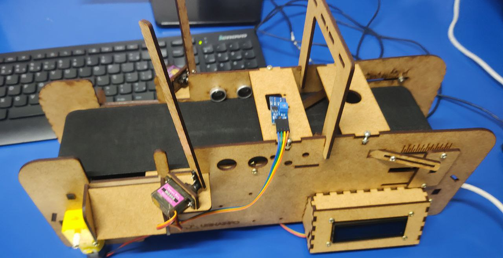

# BELT - OOP
>Arduino belt project!

  

 
## CREATORS

- [Alex](https://oficialexdev.github.io/portfolio)
- [Leticia]()
- [Marlon]()
- [Thayla]()

## PROJECT SETTINGS
 
### Components
 
| Component | Qty | Digital Pin | Analog Pin |
| :----------: | :---------: |  :---------: |:---------: |
| `Arduino` | 1 |  x|x|
| `l293d` | 1 |Enter 1 - 12 \| Enter 2 - 13 |Activator 1 e 2 - 11 (PWM)|
| `Motor` | 1 | l293d OUTPUTS 1 and 2|x|
| `Servo Motor` | 2 | Left - 9 \| Right - 10|x|
| `Ultrasonic sensor` | 1 | Trigger - 2 \| Echo - 3 |x| 
| `Infrared sensor` | 1 | 7 | A0|
| `LCD` | 1 | x | x|

>LDC PINS: VCC, GND, SDA, SCL 